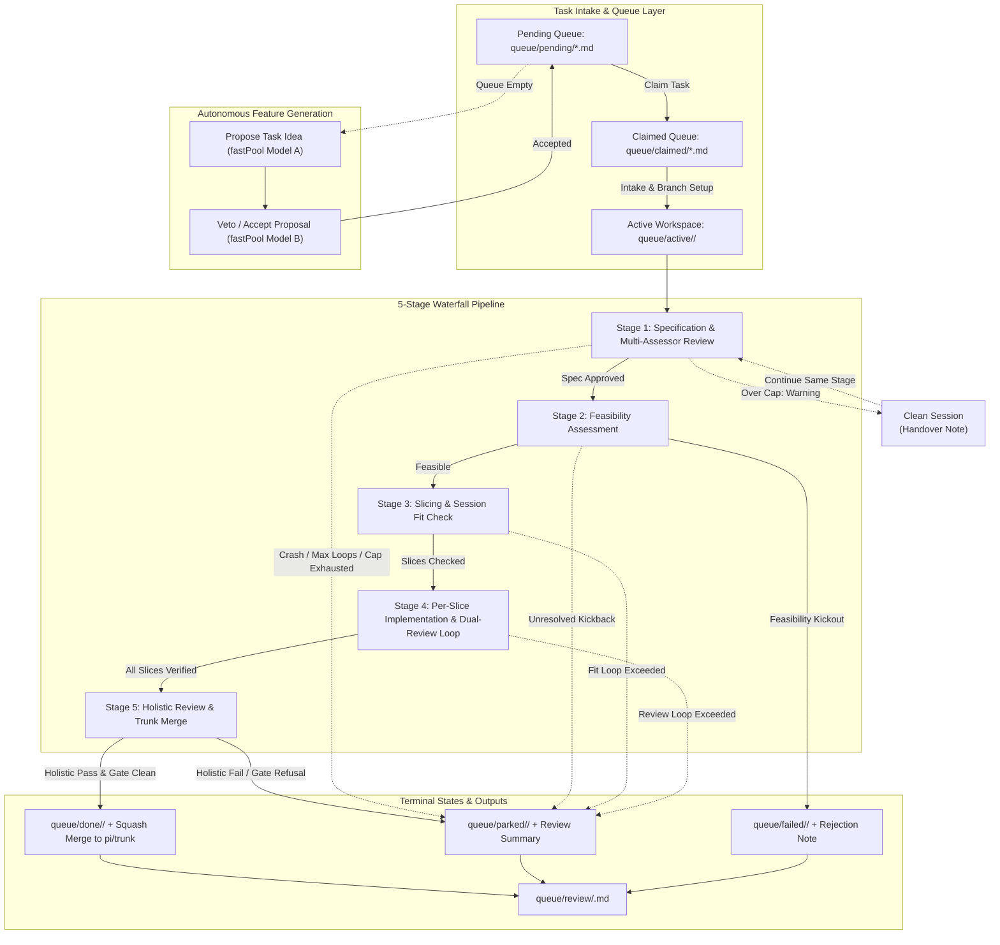
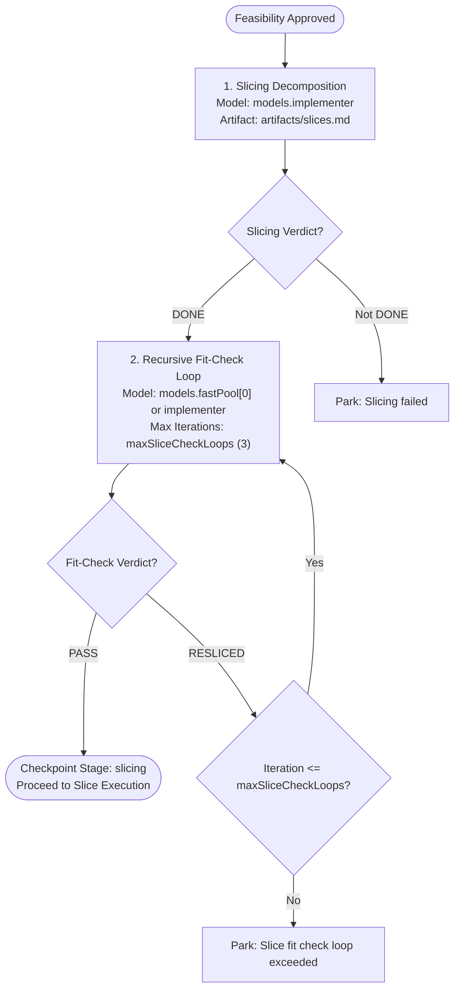

# SuperNintendoChaLLMers - Autonomous Workflow Harness

A local first self-driving pipeline that turns freeform task descriptions into reviewed,
merged features — using fresh, token-budgeted `pi` sessions at every step. 

Working with local LLMs can be a grind. The trade off with the lower model quality, smaller context, and painfully slow performance can make working with it a nightmare. Thats where ChaLLMers hopes to make life a little easier. It prescribes a workflow designed for models that run slow and have hard context limitations, without sacrificing quality or your sanity.   Intended to be long-running and accomodating of slow models by design, it can take an idea from a sentence to a squashed merge with no human input - so long as you're not in a hurry. Each "generative" stage is checked or double checked, and can be thrown back to its author for changes. Its like a real life scrum team all in one, from a lousy ticket on JIRA to a n-th degree reviewed PR.

## Installation

The project has two key dependencies - Pi and llama swap. 

- Clone this repo
- Install Pi harness and the llama-swap plugin
- Setup pi - get it talking to your local setup and pulling the model list from llama swap
- Setup your config json and map in the models you wish to use for each phase of the workflow. These should match the names served by llama-swap.
- Give it a whirl! You can run one cli invocation = one feature, or point it at a queue and say go! Or, if you're lacking imagination, you can let it build features your AI thinks would be useful. What could possibly go wrong?

---

## Holistic System Architecture



---

## Detailed Pipeline Stages & Subsystems

Every stage runs fresh `pi` sessions with explicit token budgets, communicating solely through persisted disk artifacts and strict `VERDICT: <value>` wire protocols.

---

### Stage 1: Specification & Multi-Assessor Review

Authors a comprehensive functional spec and validates it against both technical soundness and fidelity to the original requirement.


---

### Stage 2: Feasibility Assessment

Explores the codebase to confirm architectural compatibility and implementation viability.


---

### Stage 3: Slicing & Session Fit Verification

Decomposes the specification into atomic, vertically-sliced increments that each fit inside a single model context window.



---

### Stage 4: Per-Slice Implementation & Dual-Review Loop

Executes on a dedicated task branch (`pi/<task_id>`). Each slice must complete implementation, pass independent technical review, pass functional requirement review, and resolve any requested fixes before advancing.


---

### Stage 5: Holistic Review, Gate Verification & Squash-Merge

Validates the integrated change across the whole repository before merging into `pi/trunk`.


---

## Model Configuration & LLM Call Mapping

The harness maps dedicated model roles in `config.json` to optimize accuracy, domain specialization, context utilization, and execution speed.

### Model Roles

| Config Key | Intended Role | Typical Assigned Model | Context Window |
| :--- | :--- | :--- | :--- |
| `models.technicalWriter` | Spec authoring, spec assessment vs requirement, functional reviews, holistic review | `Qwen3.8-DFLASH2-TechnicalWriter` | 131,072 |
| `models.implementer` | Feasibility analysis, vertical slice planning, code implementation, technical review, code fixes | `Qwen3.8-DFLASH2-Implementer` | 131,072 |
| `models.assessor` | Independent technical soundness and quality review of functional specifications | `Ornith-1.5-35B-Q6_K.gguf` | 131,072 |
| `models.fastPool` | High-speed recursive slice fit checking and autonomous feature ideation/veto | `QwenOptimised32k`, `QwenOptimised64k`, `Qwen3.8-27B-Q4_K_M` | 32,768 – 131,072 |
| `models.randomPool` | Fallback pool for autonomous feature generation | Full roster of verified models | Variable |

### Stage-by-Stage LLM Call Configuration

| Pipeline Stage | Sub-Stage / Action | Model Role Used | Prompt Builder | Working Context Budget | Max Retries / Loops |
| :--- | :--- | :--- | :--- | :--- | :--- |
| **Stage 1: Spec** | `SPEC_AUTHOR` | `models.technicalWriter` | `prompts.spec_author` | `min(maxPromptTokens, ctx - 8192)` | 2 attempts |
| | `SPEC_ASSESS_ORNITH` | `models.assessor` | `prompts.spec_assess(..., "ornith")` | `min(maxPromptTokens, ctx - 8192)` | Shared `maxSpecKickbacks` (3) |
| | `SPEC_ASSESS_TW` | `models.technicalWriter` | `prompts.spec_assess(..., "tw")` | `min(maxPromptTokens, ctx - 8192)` | Shared `maxSpecKickbacks` (3) |
| **Stage 2: Feasibility** | `FEASIBILITY` | `models.implementer` | `prompts.feasibility` | `min(maxPromptTokens, ctx - 8192)` | 1 retry after spec revision |
| **Stage 3: Slicing** | `SLICING` | `models.implementer` | `prompts.slice` | `min(maxPromptTokens, ctx - 8192)` | 1 author attempt |
| | `SLICE_CHECK` | `models.fastPool[0]` (or implementer) | `prompts.slice_check` | `min(maxPromptTokens, ctx - 8192)` | `maxSliceCheckLoops` (3) |
| **Stage 4: Slices** | `SLICE_IMPLEMENT` | `models.implementer` | `prompts.implement_slice` | `min(maxPromptTokens, ctx - 8192)` | `maxSliceImplement` (5) |
| | `TECH_REVIEW` | `models.implementer` | `prompts.tech_review` | `min(maxPromptTokens, ctx - 8192)` | `maxSliceTechReview` (5) |
| | `FUNC_REVIEW` | `models.technicalWriter` | `prompts.func_review` | `min(maxPromptTokens, ctx - 8192)` | `maxSliceFuncReview` (5) |
| | `SLICE_FIX` | `models.implementer` | `prompts.fix_slice` | `min(maxPromptTokens, ctx - 8192)` | Interleaved with review loops |
| **Stage 5: Holistic** | `HOLISTIC` | `models.technicalWriter` | `prompts.holistic_review` | `min(maxPromptTokens, ctx - 8192)` | 1 attempt $\rightarrow$ merge to trunk |
| **Autonomous** | `AUTONOMOUS_SUGGEST` | Random model A from `fastPool` | `prompts.autonomous_suggest` | `min(maxPromptTokens, ctx - 8192)` | Target queue depth (5) |
| | `AUTONOMOUS_REVIEW` | Random model B from `fastPool` ($B \neq A$) | `prompts.autonomous_review` | `min(maxPromptTokens, ctx - 8192)` | Target queue depth (5) |

---

### Context Budget, Warning Trips & Handover

Every pi session runs with `--max-tokens <maxPromptTokens>` (default 60 000).
The stream watcher (`external/pi_cli.py`) stops the child the moment its usage
crosses that cap and reports `context_budget_exceeded`; `SessionRunner` records
the trip in `sessions.jsonl` and lifts it onto
`SessionResult.over_context_budget`.

The trip is a **warning, not a termination**. `Pipeline._run` responds by:

1. writing a handover note to
   `queue/active/<task_id>/artifacts/progress/handover-<stage>[-slice-<id>]-<n>.md`
   — stage, slice, iteration, peak vs. cap, the partial output path, and the
   text the stopped session did emit;
2. starting a **clean session** on the same stage, under the same prompt and
   verdict protocol, preceded by a pointer to that note and an instruction to
   inspect `git status` / `git log` / the artifacts and continue rather than
   redo;
3. repeating up to `maxContextContinuations` (default 3) times.

A rescued session's verdict is returned to its stage as if nothing happened: the
run continues, nothing is parked. Only when every continuation has tripped does
the stage raise `OverContextBudget`, and the task parks with the `## Handoff`
block in its review summary.

---

## Checkpointing, Resume & Operator Tooling

### Pipeline Checkpointing and Resume

Every successful stage appends to `checkpointed_stages` in `task.json` (atomic
temp+rename write) and stamps `last_updated`; completed slices are checkpointed
the same way. Re-entry skips checkpointed stages and slices, so a crash or
restart never re-burns upstream work:

- `harness.py resume <task_id>` — resume a parked/failed/active task from its
  last checkpoint (`--fresh` drops all checkpoints and starts over).
- `harness.py run --continue` / `run-task-loop --continue` — also pick up
  in-flight tasks in `active/`, skipping their completed stages.
- `harness.py restart <task_id>` — delete the active dir and stale review
  summary and start the task from scratch.

### Full Interaction Logging

Every `pi` session is archived as a Markdown transcript under
`queue/active/<task_id>/artifacts/sessions/`, named
`NNN-<stage>[-slice-<id>][-iter-<n>].md`. Each transcript holds the exact
prompt sent, the full assistant output, the child's stderr (when non-empty),
and the session metadata (stage, model, duration, peak tokens, rc, verdict,
crashed). Sequence numbers survive process restarts and never reuse a number
on disk. The journey command renders a task's full session flow with loop,
bounce and hotspot analysis:

```bash
python3 harness.py journey [task_id] [--save]   # --save writes <statsDir>/journeys/<task_id>-journey.txt
```

### Kanban Board

```bash
python3 harness.py board
```

A terminal kanban view of `pending / claimed / active / review / parked /
failed / done` with an executive summary: per-task stage, checkpoints, owner,
session stats and terminal reason. `done/` is capped to the 10 most recently
updated tasks. Auto-generated tasks (`auto-*`) are coloured differently from
user-created ones; colour is dropped automatically when stdout is not a TTY or
`NO_COLOR` is set.

---

## Managed Interruption

Release the llama.cpp model to the operator without killing the harness:

```bash
python3 harness.py interrupt                    # quick mode: borrow the model, auto-resume
python3 harness.py interrupt --stand-down       # stop work until `harness.py resume`
```

- **Quick mode** pauses the harness at its next session boundary, spawns one
  `pi` session on your terminal against the chosen model (`--model NAME`,
  default `models.technicalWriter`; or `--prompt "..."` for a one-shot query),
  and resumes the run automatically when that session exits.
- **Stand-down mode** stops the harness taking work and keeps it down until
  `python3 harness.py resume` (no task_id). Tasks stay in `active/` at their
  checkpoints.
- State lives in `<workDir>/state/interrupt.json` (atomic writes). A corrupt or
  orphaned request file is treated as an active stand-down — fail-safe: the
  model stays with the operator; recover with `harness.py resume`.
- `--no-wait` returns immediately after writing the request; `--timeout S`
  bounds the wait for the harness to pause (default: sessionTimeout + 60s).
- An interrupt never reclaims stale claims by itself; reclaim remains an
  explicit operator action (`requeue-claims`, or `--requeue-stale` on
  `run`/`run-task-loop`).

---

## Configuration Reference (`config.json`)

```json
{
  "workDir": "/home/donald/work",
  "trunkBranch": "pi/trunk",
  "taskProvider": "directory",
  "directoryProvider": {
    "pendingDir": "/home/donald/work/queue/pending"
  },
  "tokenBudget": 60000,
  "maxPromptTokens": 60000,
  "maxCrashRetries": 2,
  "maxContextContinuations": 3,
  "maxSpecKickbacks": 3,
  "maxSliceCheckLoops": 3,
  "maxSliceImplement": 5,
  "maxSliceTechReview": 5,
  "maxSliceFuncReview": 5,
  "autonomousQueueTarget": 5,
  "models": {
    "technicalWriter": "Qwen3.8-DFLASH2-TechnicalWriter",
    "implementer": "Qwen3.8-DFLASH2-Implementer",
    "assessor": "Ornith-1.5-35B-Q6_K.gguf",
    "fastPool": [
      "QwenOptimised32k",
      "QwenOptimised64k",
      "OrinthOptimised32k",
      "Ornith-1.5-35B-Q6_K",
      "Qwen3.8-27B-UD-Q8_K_XL_DFLASH2",
      "Qwen3.8-27B-UD-Q8_K_XL",
      "Qwen3.8-27B-Q4_K_M"
    ],
    "randomPool": [
      "QwenOptimised32k",
      "QwenOptimised64k",
      "QwenOptimised128k",
      "OrinthOptimised32k",
      "Ornith-1.5-35B-Q6_K",
      "Qwen3.8-27B-Q4_K_M",
      "Qwen3.8-27B-UD-Q4_K_XL",
      "Qwen3.8-27B-UD-Q8_K_XL",
      "Qwen3.8-27B-UD-Q8_K_XL_DFLASH2",
      "Qwen3.8-27B-Uncensored-HauhauCS-Aggressive-Q6_K_P",
      "Qwen3.8-DFLASH2-Implementer",
      "Qwen3.8-DFLASH2-TechnicalWriter"
    ]
  },
  "modelContext": {
    "OrinthOptimised32k": 32768,
    "Ornith-1.5-35B-Q6_K": 131072,
    "Qwen3.8-27B-Q4_K_M": 131072,
    "Qwen3.8-27B-UD-Q4_K_XL": 131072,
    "Qwen3.8-27B-UD-Q8_K_XL": 131072,
    "Qwen3.8-27B-UD-Q8_K_XL_DFLASH2": 131072,
    "Qwen3.8-27B-Uncensored-HauhauCS-Aggressive-Q6_K_P": 131072,
    "Qwen3.8-DFLASH2-Implementer": 131072,
    "Qwen3.8-DFLASH2-TechnicalWriter": 131072,
    "QwenOptimised128k": 131072,
    "QwenOptimised32k": 32768,
    "QwenOptimised64k": 65536
  }
}
```

---

## Directory & Queue Structure

```text
work/
  harness/            Engine repository
  queue/
    pending/          Incoming task cards (.md)
    claimed/          In-flight task claims (locked per runner PID)
    active/           Currently executing tasks (state + session artifacts)
      <task_id>/
        task.json     Checkpoint status, recorded workdir, slice progress
        original.md   Initial task card
        artifacts/    spec.md, slices.md, review logs, progress notes
          sessions/   Markdown transcript per pi session (prompt, output,
                      stderr, metadata), linked from the journey graph
    review/           Executive summaries (.md) generated for every terminal task
    done/             Successfully merged tasks
    failed/           Tasks rejected at feasibility (kickout)
    parked/           Tasks halted for review/crash limits, or a context budget
                      overrun that survived every handover
  state/
    interrupt.json    Managed-interrupt state (absent = no interrupt active)
  stats/
    sessions.jsonl    Unified JSONL telemetry per session
    journeys/         Journey graphs saved via `journey --save`
  logs/
    harness.log       Full pipeline execution log (rotated at 5MB)
    supervisor.log    Supervisor lifecycle log
    children/         Raw stdout/stderr capture per child process
```

---

## CLI Usage

```bash
# Process all pending tasks, then enter autonomous generation mode
python3 harness.py run [--continue] [--requeue-stale]

# Process a single specific task card
python3 harness.py run-task <file.md> [--fresh] [--continue]

# Claim and process exactly one task from pending/
python3 harness.py run-one

# Process pending tasks in a loop until empty, then exit
python3 harness.py run-task-loop [--continue] [--requeue-stale]

# Autonomous mode: generate and validate tasks until queue target is met
python3 harness.py autonomous

# Inspect queue distribution and session performance metrics
python3 harness.py status
python3 harness.py report

# Kanban-style queue view with executive summary
python3 harness.py board

# Journey graph + bottleneck analysis for a task
python3 harness.py journey [task_id] [--save]

# Resume a parked/active task from its latest checkpoint
python3 harness.py resume <task_id> [--yes] [--fresh]

# Clear an active interrupt and resume the run (no task_id)
python3 harness.py resume

# Restart a task from scratch (deletes checkpoints)
python3 harness.py restart <task_id> [--yes]

# Managed interruption: release the model to the operator
python3 harness.py interrupt [--stand-down] [--no-wait] [--timeout SECONDS]
                             [--model NAME] [--prompt TEXT]

# Requeue a parked or failed task back to pending
python3 harness.py unpark <task_id>

# Reclaim orphaned claims from stranded processes
python3 harness.py requeue-claims [--older-than HOURS] [--dry-run]
```
