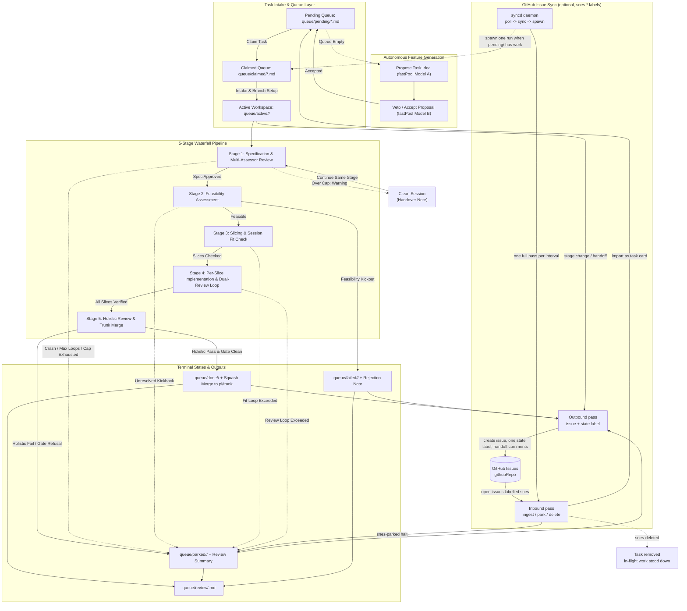
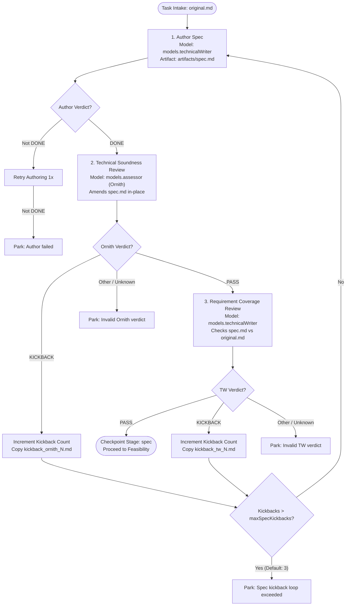
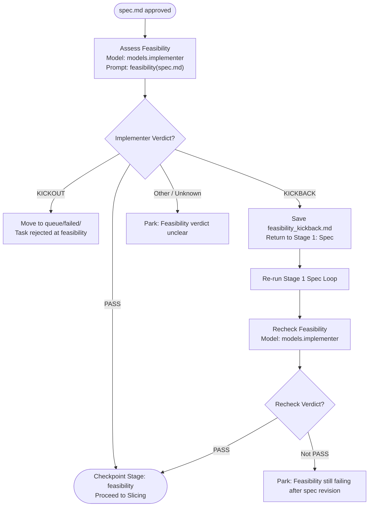
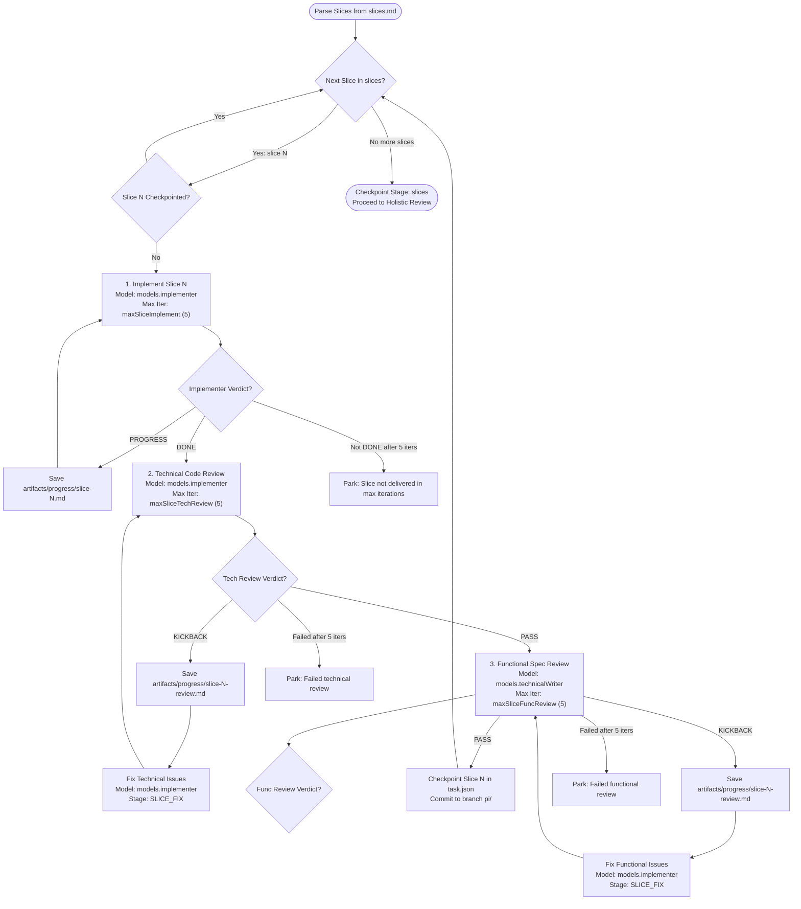
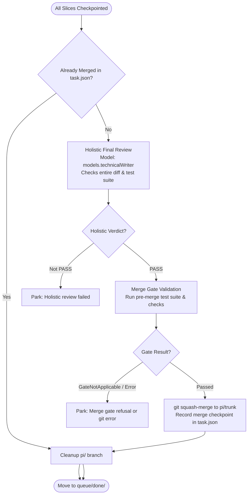
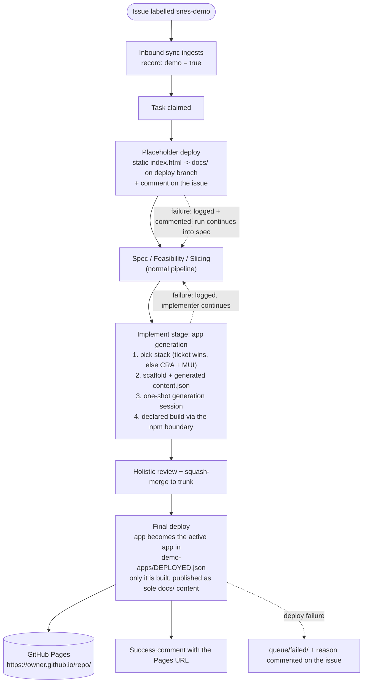

# SuperNintendoChaLLMers - Autonomous Workflow Harness

A local first self-driving pipeline that turns freeform task descriptions into reviewed,
merged features — using fresh, token-budgeted `pi` sessions at every step. 

Working with local LLMs can be a grind. The trade off with the lower model quality, smaller context, and painfully slow performance can make working with it a nightmare. Thats where ChaLLMers hopes to make life a little easier. It prescribes a workflow designed for models that run slow and have hard context limitations, without sacrificing quality or your sanity.   Intended to be long-running and accomodating of slow models by design, it can take an idea from a sentence to a squashed merge with no human input - so long as you're not in a hurry. Each "generative" stage is checked or double checked, and can be thrown back to its author for changes. Its like a real life scrum team all in one, from a lousy ticket on JIRA to a n-th degree reviewed PR.

### What's in the box

- **5-stage waterfall pipeline** — spec → feasibility → slicing → per-slice implementation with dual review → holistic review and squash-merge, every stage a fresh token-budgeted `pi` session with a strict verdict protocol.
- **Checkpointing and resume** — stages and slices are checkpointed to `task.json`, so a crash, a kill or a restart never re-burns finished work.
- **Two-way GitHub issue sync** *(optional)* — issues labelled `snes` become queue tasks, and every queue move is mirrored back as an issue state label plus handoff comments. Inbound triggers let you park or delete work from the web UI.
- **`syncd` daemon** *(optional)* — polls, syncs, and spawns exactly one harness run when `pending/` has work and nothing is running. Point it at a repo and walk away.
- **Managed interruption** — hand the model back to yourself at the next session boundary, borrow it for a terminal session, and have the run resume itself.
- **Full interaction logging, journey graphs and a terminal kanban board** — every prompt, output and verdict archived per session, with loop/hotspot analysis.
- **Demo web-app deployment** *(optional)* — an issue labelled `snes-demo` gets a placeholder on GitHub Pages within moments of being claimed, and a generated, built static app on Pages once it merges.

## Installation

The project has two key dependencies - Pi and llama swap. 

- Clone this repo
- Install Pi harness and the llama-swap plugin
- Setup pi - get it talking to your local setup and pulling the model list from llama swap
- Setup your config json and map in the models you wish to use for each phase of the workflow. These should match the names served by llama-swap.
- *(Optional)* Add `githubPat` + `githubRepo` to `config.json` to turn on the GitHub issue sync and the `syncd` daemon. Leave them empty and the whole sync layer is inert — no HTTP, no labels, no comments.
- *(Optional)* Add a `demo` section with `"enabled": true` to turn on the `snes-demo` → GitHub Pages feature. See [Demo Web-App Deployment](#demo-web-app-deployment-snes-demo).
- Give it a whirl! You can run one cli invocation = one feature, or point it at a queue and say go! Or, if you're lacking imagination, you can let it build features your AI thinks would be useful. What could possibly go wrong?

---

## Holistic System Architecture



---

## Detailed Pipeline Stages & Subsystems

Every stage runs fresh `pi` sessions with explicit token budgets, communicating solely through persisted disk artifacts and strict `VERDICT: <value>` wire protocols.

---

### Stage 1: Specification & Multi-Assessor Review

Authors a comprehensive functional spec and validates it against both technical soundness and fidelity to the original requirement.



---

### Stage 2: Feasibility Assessment

Explores the codebase to confirm architectural compatibility and implementation viability.



---

### Stage 3: Slicing & Session Fit Verification

Decomposes the specification into atomic, vertically-sliced increments that each fit inside a single model context window.


---

### Stage 4: Per-Slice Implementation & Dual-Review Loop

Executes on a dedicated task branch (`pi/<task_id>`). Each slice must complete implementation, pass independent technical review, pass functional requirement review, and resolve any requested fixes before advancing.



---

### Stage 5: Holistic Review, Gate Verification & Squash-Merge

Validates the integrated change across the whole repository before merging into `pi/trunk`.



---

## Model Configuration & LLM Call Mapping

The harness maps dedicated model roles in `config.json` to optimize accuracy, domain specialization, context utilization, and execution speed.

### Model Roles

| Config Key | Intended Role | Typical Assigned Model | Context Window |
| :--- | :--- | :--- | :--- |
| `models.technicalWriter` | Spec authoring, spec assessment vs requirement, functional reviews, holistic review | `Qwen3.8-DFLASH2-TechnicalWriter` | 131,072 |
| `models.implementer` | Feasibility analysis, vertical slice planning, code implementation, technical review, code fixes | `Qwen3.8-DFLASH2-Implementer` | 131,072 |
| `models.assessor` | Independent technical soundness and quality review of functional specifications | `Ornith-1.5-35B-Q6_K.gguf` | 131,072 |
| `models.fastPool` | High-speed recursive slice fit checking and autonomous feature ideation/veto | `QwenOptimised32k`, `QwenOptimised64k`, `Qwen3.8-27B-Q4_K_M` | 32,768 – 131,072 |
| `models.randomPool` | Fallback pool for autonomous feature generation | Full roster of verified models | Variable |

### Stage-by-Stage LLM Call Configuration

| Pipeline Stage | Sub-Stage / Action | Model Role Used | Prompt Builder | Working Context Budget | Max Retries / Loops |
| :--- | :--- | :--- | :--- | :--- | :--- |
| **Stage 1: Spec** | `SPEC_AUTHOR` | `models.technicalWriter` | `prompts.spec_author` | `min(maxPromptTokens, ctx - 8192)` | 2 attempts |
| | `SPEC_ASSESS_ORNITH` | `models.assessor` | `prompts.spec_assess(..., "ornith")` | `min(maxPromptTokens, ctx - 8192)` | Shared `maxSpecKickbacks` (3) |
| | `SPEC_ASSESS_TW` | `models.technicalWriter` | `prompts.spec_assess(..., "tw")` | `min(maxPromptTokens, ctx - 8192)` | Shared `maxSpecKickbacks` (3) |
| **Stage 2: Feasibility** | `FEASIBILITY` | `models.implementer` | `prompts.feasibility` | `min(maxPromptTokens, ctx - 8192)` | 1 retry after spec revision |
| **Stage 3: Slicing** | `SLICING` | `models.implementer` | `prompts.slice` | `min(maxPromptTokens, ctx - 8192)` | 1 author attempt |
| | `SLICE_CHECK` | `models.fastPool[0]` (or implementer) | `prompts.slice_check` | `min(maxPromptTokens, ctx - 8192)` | `maxSliceCheckLoops` (3) |
| **Stage 4: Slices** | `SLICE_IMPLEMENT` | `models.implementer` | `prompts.implement_slice` | `min(maxPromptTokens, ctx - 8192)` | `maxSliceImplement` (5) |
| | `TECH_REVIEW` | `models.implementer` | `prompts.tech_review` | `min(maxPromptTokens, ctx - 8192)` | `maxSliceTechReview` (5) |
| | `FUNC_REVIEW` | `models.technicalWriter` | `prompts.func_review` | `min(maxPromptTokens, ctx - 8192)` | `maxSliceFuncReview` (5) |
| | `SLICE_FIX` | `models.implementer` | `prompts.fix_slice` | `min(maxPromptTokens, ctx - 8192)` | Interleaved with review loops |
| **Stage 5: Holistic** | `HOLISTIC` | `models.technicalWriter` | `prompts.holistic_review` | `min(maxPromptTokens, ctx - 8192)` | 1 attempt $\rightarrow$ merge to trunk |
| **Autonomous** | `AUTONOMOUS_SUGGEST` | Random model A from `fastPool` | `prompts.autonomous_suggest` | `min(maxPromptTokens, ctx - 8192)` | Target queue depth (5) |
| | `AUTONOMOUS_REVIEW` | Random model B from `fastPool` ($B \neq A$) | `prompts.autonomous_review` | `min(maxPromptTokens, ctx - 8192)` | Target queue depth (5) |

---

### Context Budget, Warning Trips & Handover

Every pi session runs with `--max-tokens <maxPromptTokens>` (default 60 000).
The stream watcher (`external/pi_cli.py`) stops the child the moment its usage
crosses that cap and reports `context_budget_exceeded`; `SessionRunner` records
the trip in `sessions.jsonl` and lifts it onto
`SessionResult.over_context_budget`.

The trip is a **warning, not a termination**. `Pipeline._run` responds by:

1. writing a handover note to
   `queue/active/<task_id>/artifacts/progress/handover-<stage>[-slice-<id>]-<n>.md`
   — stage, slice, iteration, peak vs. cap, the partial output path, and the
   text the stopped session did emit;
2. starting a **clean session** on the same stage, under the same prompt and
   verdict protocol, preceded by a pointer to that note and an instruction to
   inspect `git status` / `git log` / the artifacts and continue rather than
   redo;
3. repeating up to `maxContextContinuations` (default 3) times.

A rescued session's verdict is returned to its stage as if nothing happened: the
run continues, nothing is parked. Only when every continuation has tripped does
the stage raise `OverContextBudget`, and the task parks with the `## Handoff`
block in its review summary.

---

## Checkpointing, Resume & Operator Tooling

### Pipeline Checkpointing and Resume

Every successful stage appends to `checkpointed_stages` in `task.json` (atomic
temp+rename write) and stamps `last_updated`; completed slices are checkpointed
the same way. Re-entry skips checkpointed stages and slices, so a crash or
restart never re-burns upstream work:

- `harness.py resume <task_id>` — resume a parked/failed/active task from its
  last checkpoint (`--fresh` drops all checkpoints and starts over).
- `harness.py run --continue` / `run-task-loop --continue` — also pick up
  in-flight tasks in `active/`, skipping their completed stages.
- `harness.py restart <task_id>` — delete the active dir and stale review
  summary and start the task from scratch.

### Full Interaction Logging

Every `pi` session is archived as a Markdown transcript under
`queue/active/<task_id>/artifacts/sessions/`, named
`NNN-<stage>[-slice-<id>][-iter-<n>].md`. Each transcript holds the exact
prompt sent, the full assistant output, the child's stderr (when non-empty),
and the session metadata (stage, model, duration, peak tokens, rc, verdict,
crashed). Sequence numbers survive process restarts and never reuse a number
on disk. The journey command renders a task's full session flow with loop,
bounce and hotspot analysis:

```bash
python3 harness.py journey [task_id] [--save]     # <statsDir>/journeys/<task_id>-journey.txt
python3 harness.py journey-md [task_id] [--save]  # Markdown, with a link to each transcript
```

### Kanban Board

```bash
python3 harness.py board
```

A terminal kanban view of `pending / claimed / active / review / parked /
failed / done` with an executive summary: per-task stage, checkpoints, owner,
session stats and terminal reason. `done/` is capped to the 10 most recently
updated tasks. Auto-generated tasks (`auto-*`) are coloured differently from
user-created ones; colour is dropped automatically when stdout is not a TTY or
`NO_COLOR` is set. `board --json` emits the same data as JSON for dashboards.

---

## GitHub Issue Sync

Two-way sync between the queue and one GitHub repository, so the issue tracker
can be a front door to the pipeline and the pipeline can report back to it.

**Enabled-safe by construction.** The feature lives or dies on two config keys:
`githubPat` and `githubRepo` (`owner/name`). With both set it is fully live; with
either empty or absent it is completely inert — no HTTP calls, every sync hook is a
no-op, nothing logs an error, and `harness.py sync` prints `github sync disabled`
and exits 0. `githubApiBaseUrl` overrides the REST root for GHES installs.

A full pass is two ordered phases: **inbound** (issues → queue) then **outbound**
(queue → issues).

### Label vocabulary

Every label the sync owns is prefixed `snes-` (or is the bare `snes`). Anything else
belongs to a human and is never added or removed.

| Label | Kind | Effect |
| :--- | :--- | :--- |
| `snes` | trigger / subscription | An open issue carrying it becomes a `pending/` task card. Never removed by outbound sync. |
| `snes-demo` | trigger / subscription | Ingest as above, flagged as a demo request. Never removed by outbound sync. |
| `snes-parked` | trigger + state | Halts the matching task from any location into `parked/`. Idempotent. |
| `snes-deleted` | trigger | Deletes the task; in-flight work is stood down at its next session boundary (never a kill). |
| `snes-pending` / `-claimed` / `-active` / `-review` / `-parked` / `-failed` / `-done` | state | Mirror of the task's queue location. Exactly one per issue, applied as a diff. |

When an issue carries several triggers, exactly one action runs, in the order
**delete > park > demo > ingest**.

### Inbound: issues → queue

- **Ingest** — an open issue carrying `snes` becomes `queue/pending/<slug>.md` with
  the issue body as its content, idempotently: re-running the pass never duplicates
  an imported task.
- **Matching** — the task's metadata record wins (it names the issue and repo); an
  entry whose record points at a *different* issue is claimed by that issue and
  never title-matched here; only unlinked entries fall back to normalized-title
  matching (lowercase, `_` read as space).
- **Halt** — `snes-parked` parks the task from any location through the lifecycle
  park path, so it gets an executive summary; `snes-deleted` removes it outright.
  Both stop in-flight work via the managed-interrupt mechanism — a flag honoured at
  the session boundary, never a signal to a running session.

### Outbound: queue → issues

Every task in the seven synced locations gets exactly one open issue carrying
exactly one `snes-<state>` label:

1. **Match** — a record naming this repo wins; otherwise the lowest-numbered open
   issue whose title normalizes equal to the task name (with a warning when several
   match).
2. **Closed match parks** — no open match but a closed one moves the task to
   `parked/` with reason `GitHub issue closed` instead of recreating the issue. A
   plain park, not a halt: closes never stand a session down.
3. **Create** — neither open nor closed: a new issue titled with the task name and
   the task markdown as its body; the returned number is recorded.
4. **State label** — a diff, never replace-all: add the target label when missing,
   remove only stale `snes-*` *state* labels.

Outbound iterates over tasks that exist and nothing else — a locally deleted task
reopens, recreates or re-labels nothing.

### Handoff comments

Three kinds of handoff prose are mirrored onto the task's issue as exactly one
comment each: a context-cap handover note, a park-with-handoff section, and the
terminal executive summary. Duplicate suppression rides on a content-stable event id
(task id + stage + a hash of the prose) whose comment id is stored in the task
record, so a retried pass never re-posts.

### When passes run

| Trigger | What runs |
| :--- | :--- |
| `harness.py sync` | One full two-way pass; prints the counts summary line. |
| A queue move (stage change) | A full pass. |
| A handoff on an in-flight task | The comment, then a targeted per-task sync plus a full inbound pass, so an external halt is noticed promptly. |
| `harness.py syncd` | One full pass per poll interval (see below). |

### Failure posture

A failure must never cost the harness work. Per-item failures are logged and
skipped, and the comment poster swallows its own errors — a sync failure never fails
a task, loses handoff prose, or breaks a queue move. A pass aborts cleanly only on
the two conditions that make further calls pointless (spent rate-limit budget, auth
disabled): the remaining phases are skipped, the counts gathered so far stand, and
the summary line ends `ABORTED (<reason>)`. Unfinished work rolls to the next pass.
The PAT is never logged and never written to stats rows, task files or issue
comments.

---

## The `syncd` Daemon

```bash
python3 harness.py syncd
```

The daemon does exactly two things per pass:

1. **Sync** — one full two-way pass, skipped entirely when GitHub is unconfigured,
   in which case the daemon is a local `pending/` watcher only.
2. **Spawn** — start exactly one harness run (`run-task-loop`) when `pending/` holds
   at least one task card *and* no run is active. "Active" means the `run.lock` a run
   command holds, or a spawned child that has not exited yet — the gap between
   spawning and the child taking its own lock must not invite a second spawn.

Operational behaviour:

- **Interval** — `githubSyncIntervalS` (default 60s).
- **Single instance** — `<workDir>/syncd.lock`. A second `syncd` exits non-zero with
  the lock message; a lock left behind by a killed daemon is detected as stale (dead
  PID) and taken, so a crash needs no manual cleanup.
- **Failure backoff** — after 5 consecutive failed sync passes the interval goes 5x
  and exactly one warning is logged per backoff *entry*. A successful pass resets
  both the counter and the interval. A pass counts as failed when it raises *or*
  when it returns an aborted report — the production sync callable never raises on
  GitHub errors, so the abort flag is the only failure signal available.
- **Clean shutdown** — `SIGINT`/`SIGTERM` end the loop after the current pass,
  release the lock and exit 0.
- **Spawning resumes** — the daemon *reaps* the child it spawned
  (`waitpid(WNOHANG)`) rather than probing it, so a finished run cannot linger as a
  zombie, read as "still active" forever and starve the queue in silence.

---

## Task Metadata Records

One JSON document per task, keyed by **task id**, at `queue/.meta/<task-id>.json`:

```json
{
  "version": 1,
  "github": { "issue": 12, "repo": "owner/name",
              "comment_ids": {"<event-id>": 34}, "demo": false },
  "claim":  { "owner": "runner-1", "claimed_at": 1767225600.0 }
}
```

Because the path is derived from the task id and not from a task-file name, it does
not change on a queue transition — there is nothing to carry along a move and
nothing to orphan behind in `pending/`. This replaced the older path-derived
`.gh.json` / `.claim.json` sidecars.

- **One concern per write** — every write is a read-modify-write of the current
  record targeting exactly one section, so a claim write never wipes the `github`
  section and a linkage write never wipes `claim`.
- **Atomic** — temp file + `os.replace`, the same posture as every lifecycle move.
- **Fail-open reads** — an absent, empty, corrupt or non-object record reads as
  "unlinked / unowned" and never raises; an unlinked task falls back to title
  matching.
- **Legacy migration** — old sidecars are still read, as lowest precedence, and
  folded into the record lazily on sight: the new record is written first and the
  legacy files removed only once it is durably in place. A queue with no legacy
  files is left untouched.
- **Invisible to task enumeration** — the directory is dot-prefixed, so no `*.md`
  task glob ever matches it and the daemon's pending check never mistakes metadata
  for work.

---

## Demo Web-App Deployment (`snes-demo`)

An opt-in demonstration feature: a GitHub issue labelled `snes-demo` produces a
small static web app, generated by the model, built, and published to GitHub Pages —
with a placeholder visible as soon as the request is picked up.

It requires both `demo.enabled` and GitHub sync to be configured. With no `demo`
section in `config.json` the feature is off, the `snes-demo` label is ignored, and
every pipeline hook is a no-op.



Details worth knowing:

- **Placeholder first** — the pre-spec deploy is a no-build static `index.html`
  acknowledging the request, so it works even when npm is unavailable. It never
  raises: a failure is logged, commented on the issue, and the run continues into
  spec.
- **Stack selection** — an explicit request in the ticket wins; otherwise the default
  is create-react-app + Material UI with a dark theme. The stack is fixed at
  generation time and never silently swapped. Builds run through the npm boundary
  with fixed argv fragments — no shell, and nothing from the ticket or the model ever
  becomes a command.
- **Content generation** — the ticket text goes to `demo.contentModel` as data
  (JSON-quoted, never executed). A ticket with no actionable topic never reaches the
  model; a model that fails, or answers with the incoherence sentinel after one
  retry, produces fallback content about `demo.fallbackTopic`.
- **One active app** — `demo-apps/DEPLOYED.json` names the app that gets built and
  published. Older app directories stay in the repo as history and are never built
  or served.
- **App naming** — `demo-apps/<kebab-name>/` derived from the issue title, issue
  number appended on collision, fixed fallback for titles with no usable characters.
- **Pages-safe paths** — the scaffold sets a base/public path that works under a
  Pages project-site subpath. The harness formats the Pages URL; it never probes it.
- **Failure routing** — no demo hook may crash the harness. A placeholder failure
  is logged, commented on the issue, and the run continues into spec. A generation
  failure is logged and the implementer carries on with the repo as it stands. Only
  the **final deploy** routes the task: if the Pages publication does not happen the
  task goes to `failed/` with the reason commented on the issue — and the app source,
  already merged, is not rolled back.

---

## Managed Interruption

Release the llama.cpp model to the operator without killing the harness:

```bash
python3 harness.py interrupt                    # quick mode: borrow the model, auto-resume
python3 harness.py interrupt --stand-down       # stop work until `harness.py resume`
```

- **Quick mode** pauses the harness at its next session boundary, spawns one
  `pi` session on your terminal against the chosen model (`--model NAME`,
  default `models.technicalWriter`; or `--prompt "..."` for a one-shot query),
  and resumes the run automatically when that session exits.
- **Stand-down mode** stops the harness taking work and keeps it down until
  `python3 harness.py resume` (no task_id). Tasks stay in `active/` at their
  checkpoints.
- State lives in `<workDir>/state/interrupt.json` (atomic writes). A corrupt or
  orphaned request file is treated as an active stand-down — fail-safe: the
  model stays with the operator; recover with `harness.py resume`.
- `--no-wait` returns immediately after writing the request; `--timeout S`
  bounds the wait for the harness to pause (default: sessionTimeout + 60s).
- An interrupt never reclaims stale claims by itself; reclaim remains an
  explicit operator action (`requeue-claims`, or `--requeue-stale` on
  `run`/`run-task-loop`).

---

## Configuration Reference (`config.json`)

```json
{
  "workDir": "/home/donald/work",
  "repoDir": "/srv/pi-harness/harness_build",
  "trunkBranch": "pi/trunk",
  "githubPat": "",
  "githubRepo": "owner/repo",
  "githubApiBaseUrl": "https://api.github.com",
  "githubSyncIntervalS": 60,
  "demo": {
    "enabled": false,
    "deployBranch": "pi/app-demo",
    "appsDir": "demo-apps",
    "docsDir": "docs",
    "contentModel": "GLM4.5-AIR_Q4_K_M",
    "fallbackTopic": "History of Morris Dancing",
    "deployDir": "/home/donald/work/demo-deploy"
  },
  "llmHealthUrl": "",
  "llmHealthEnabled": true,
  "taskProvider": "directory",
  "directoryProvider": {
    "pendingDir": "/home/donald/work/queue/pending"
  },
  "tokenBudget": 60000,
  "maxPromptTokens": 60000,
  "maxCrashRetries": 2,
  "maxContextContinuations": 3,
  "maxSpecKickbacks": 3,
  "maxSliceCheckLoops": 3,
  "maxSliceImplement": 5,
  "maxSliceTechReview": 5,
  "maxSliceFuncReview": 5,
  "sessionTimeout": 3600,
  "toolTimeout": 60,
  "maxOutputBytes": 2097152,
  "toolUlimitNproc": 50,
  "toolUlimitVmemKB": 8388608,
  "autonomousQueueTarget": 5,
  "models": {
    "technicalWriter": "Qwen3.8-DFLASH2-TechnicalWriter",
    "implementer": "Qwen3.8-DFLASH2-Implementer",
    "assessor": "Ornith-1.5-35B-Q6_K.gguf",
    "fastPool": [
      "QwenOptimised32k",
      "QwenOptimised64k",
      "OrinthOptimised32k",
      "Ornith-1.5-35B-Q6_K",
      "Qwen3.8-27B-UD-Q8_K_XL_DFLASH2",
      "Qwen3.8-27B-UD-Q8_K_XL",
      "Qwen3.8-27B-Q4_K_M"
    ],
    "randomPool": [
      "QwenOptimised32k",
      "QwenOptimised64k",
      "QwenOptimised128k",
      "OrinthOptimised32k",
      "Ornith-1.5-35B-Q6_K",
      "Qwen3.8-27B-Q4_K_M",
      "Qwen3.8-27B-UD-Q4_K_XL",
      "Qwen3.8-27B-UD-Q8_K_XL",
      "Qwen3.8-27B-UD-Q8_K_XL_DFLASH2",
      "Qwen3.8-27B-Uncensored-HauhauCS-Aggressive-Q6_K_P",
      "Qwen3.8-DFLASH2-Implementer",
      "Qwen3.8-DFLASH2-TechnicalWriter"
    ]
  },
  "modelContext": {
    "OrinthOptimised32k": 32768,
    "Ornith-1.5-35B-Q6_K": 131072,
    "Qwen3.8-27B-Q4_K_M": 131072,
    "Qwen3.8-27B-UD-Q4_K_XL": 131072,
    "Qwen3.8-27B-UD-Q8_K_XL": 131072,
    "Qwen3.8-27B-UD-Q8_K_XL_DFLASH2": 131072,
    "Qwen3.8-27B-Uncensored-HauhauCS-Aggressive-Q6_K_P": 131072,
    "Qwen3.8-DFLASH2-Implementer": 131072,
    "Qwen3.8-DFLASH2-TechnicalWriter": 131072,
    "QwenOptimised128k": 131072,
    "QwenOptimised32k": 32768,
    "QwenOptimised64k": 65536
  }
}
```

`repoDir` is the target git repository the pipeline branches and merges in;
any subcommand accepts `--repo <path>` (`--repo-dir`) to override it. The
guardrail keys bound execution: `sessionTimeout` is the wall-clock cap per pi
session, `toolTimeout` the cap for wrapped shell helpers, `maxOutputBytes` the
per-stream capture cap, and `toolUlimitNproc` / `toolUlimitVmemKB` the process
and virtual-memory ulimits applied to wrapped shells.

`maxPromptTokens` is a *cap*, not a window: the window comes from `modelContext` (or
a `32k`/`64k`/`128k` name suffix, else a 128k default), and a model's working budget
is `max(4096, min(maxPromptTokens, window - 8192))`.

### Optional feature keys

| Key | Default | Effect |
| :--- | :--- | :--- |
| `githubPat` | empty | PAT for issue sync. Empty disables the whole sync layer. Secret: never logged, never in stats rows, task files or comments. |
| `githubRepo` | empty | The one synced repository, `owner/name`. |
| `githubApiBaseUrl` | `https://api.github.com` | REST API root; override for GHES. An empty configured value falls back to github.com rather than disabling. |
| `githubSyncIntervalS` | 60 | `syncd` poll interval (5x while in failure backoff). |
| `demo.enabled` | false | Master switch for the `snes-demo` → Pages feature. Also needs GitHub sync configured. |
| `demo.deployBranch` | `pi/app-demo` | Long-lived Pages source branch the apps are published to. |
| `demo.appsDir` | `demo-apps` | Repo-root source directory for generated apps. |
| `demo.docsDir` | `docs` | Pages artifact directory, on the deploy branch only. |
| `demo.contentModel` | `GLM4.5-AIR_Q4_K_M` | One-shot model for site-content generation. |
| `demo.fallbackTopic` | `History of Morris Dancing` | Subject of the fallback content when a ticket has no usable topic. |
| `demo.deployDir` | `<workDir>/demo-deploy` | Dedicated checkout used to publish demo apps. |
| `llmHealthUrl` | empty | Model-server health endpoint for the pre-run probe. Empty disables the gate. |
| `llmHealthEnabled` | true | Explicit off switch, even with a URL configured. |

---

## Directory & Queue Structure

```text
work/
  harness/            Engine repository
  run.lock            Held by a harness run for its whole life (PID inside);
                      the daemon reads it before spawning
  syncd.lock          The syncd daemon's single-instance lock (PID inside)
  queue/
    .meta/            One metadata record per task, <task-id>.json: GitHub
                      linkage (issue, repo, handoff comment ids, demo flag) and
                      claim ownership. Keyed by task id, so it survives every
                      queue transition and orphans nothing
    pending/          Incoming task cards (.md)
    claimed/          In-flight task claims (locked per runner PID)
    active/           Currently executing tasks (state + session artifacts)
      <task_id>/
        task.json     Checkpoint status, recorded workdir, slice progress
        original.md   Initial task card
        artifacts/    spec.md, slices.md, review logs, progress notes
          sessions/   Markdown transcript per pi session (prompt, output,
                      stderr, metadata), linked from the journey graph
    review/           Executive summaries (.md) generated for every terminal task
    done/             Successfully merged tasks
    failed/           Tasks rejected at feasibility (kickout)
    parked/           Tasks halted for review/crash limits, a context budget
                      overrun that survived every handover, or a closed issue
  state/
    interrupt.json    Managed-interrupt state (absent = no interrupt active)
  stats/
    sessions.jsonl    Unified JSONL telemetry per session
    journeys/         Journey graphs saved via `journey --save` / `journey-md`
  logs/
    harness.log       Full pipeline execution log (rotated at 5MB)
    supervisor.log    Supervisor lifecycle log
    children/         Raw stdout/stderr capture per child process
    demo-generation/  Raw output of demo app generation sessions
  demo-deploy/        Dedicated checkout used to publish demo apps (demo.deployDir)
```

Legacy `*.md.gh.json` / `.claim.json` sidecars left by older releases are still read
as lowest precedence and folded into `queue/.meta/` lazily on sight.

---

## CLI Usage

```bash
# Process all pending tasks, then enter autonomous generation mode
python3 harness.py run [--continue] [--requeue-stale] [--repo PATH]

# Process a single specific task card
python3 harness.py run-task <file.md> [--fresh] [--continue]

# Claim and process exactly one task from pending/
python3 harness.py run-one

# Process pending tasks in a loop until empty, then exit
python3 harness.py run-task-loop [--continue] [--requeue-stale]

# Autonomous mode: generate and validate tasks until queue target is met
python3 harness.py autonomous

# One two-way GitHub issue sync pass. Prints "github sync disabled" and exits 0
# when githubPat / githubRepo are unconfigured.
python3 harness.py sync

# Sync daemon: poll + sync, and spawn one run when pending/ has work and no run
# is active. Single instance via <workDir>/syncd.lock — a second syncd exits
# non-zero while a live one holds it. SIGINT/SIGTERM stop it after its pass.
python3 harness.py syncd

# Inspect queue distribution and session performance metrics
python3 harness.py status
python3 harness.py report
python3 harness.py report-json          # same numbers, machine-readable
python3 harness.py export-stats-csv [out.csv]
python3 harness.py stats-prune [--max-rows N]   # trim sessions.jsonl (default 10000)

# Kanban-style queue view with executive summary
python3 harness.py board [--json]

# Journey graph + bottleneck analysis for a task
python3 harness.py journey [task_id] [--save]

# Same journey as Markdown with links to each session transcript
python3 harness.py journey-md [task_id] [--save]

# Resume a parked/active task from its latest checkpoint
python3 harness.py resume <task_id> [--yes] [--fresh]

# Clear an active interrupt and resume the run (no task_id)
python3 harness.py resume

# Restart a task from scratch (deletes checkpoints)
python3 harness.py restart <task_id> [--yes]

# Managed interruption: release the model to the operator
python3 harness.py interrupt [--stand-down] [--no-wait] [--timeout SECONDS]
                             [--model NAME] [--prompt TEXT]

# Requeue a parked or failed task back to pending
python3 harness.py unpark <task_id>

# Reclaim orphaned claims from stranded processes
python3 harness.py requeue-claims [--older-than HOURS] [--dry-run]
```
